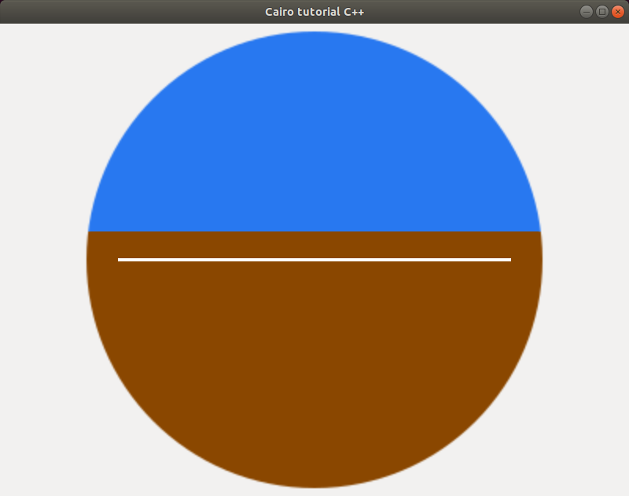

# Cairo-Tutorial
Aircraft attitude indicator made with cairo based on example [6-mouse-position](https://github.com/morgner/Cairo-Tutorial#6-mouse-position) by [Manfred Morgner](https://github.com/morgner).

Requirements:
```
sudo apt-get install clang
sudo apt-get install libgtkmm-3.0-dev
sudo apt-get install cairomm-1.0
```

[How to compile](https://github.com/morgner/Cairo-Tutorial#how-to-compile)


